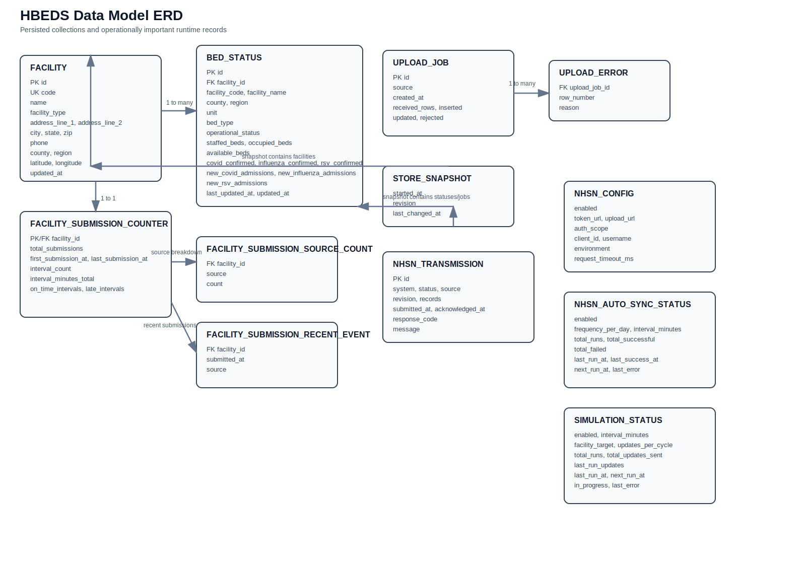
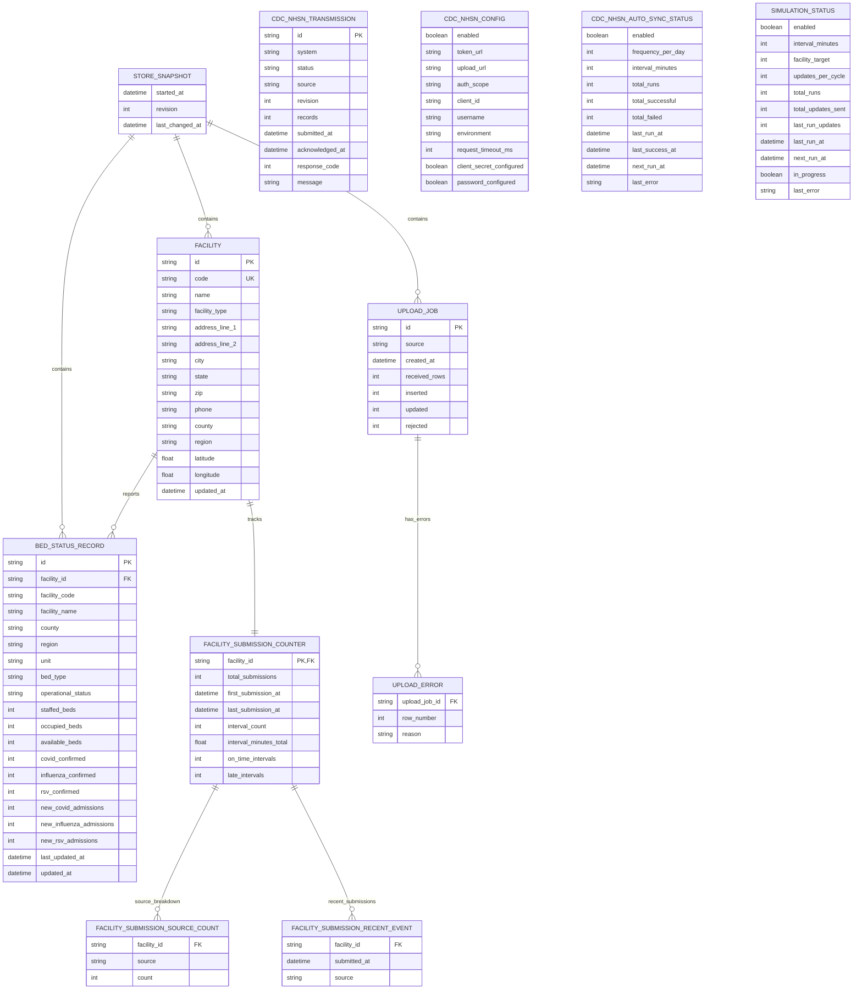

# HBEDS Data Model ERD

This document captures the persisted data model and operationally important derived records in HBEDS.

## Diagram

## Mermaid Source

## Notes

### Persisted today

The file-backed repository currently persists these top-level collections:

- `facilities`
- `bedStatuses`
- `uploadJobs`
- `facilitySubmissions`
- store metadata: `startedAt`, `revision`, `lastChangedAt`

### Important denormalizations

`BED_STATUS_RECORD` duplicates facility attributes for operational convenience:

- `facility_code`
- `facility_name`
- `county`
- `region`

That makes read paths simpler, but it means facility updates must fan out to related bed-status rows, which the store already does.

### Modeled but not persisted with the main store file

These are operational runtime records rather than core store entities:

- `CDC_NHSN_TRANSMISSION`
- `CDC_NHSN_CONFIG`
- `CDC_NHSN_AUTO_SYNC_STATUS`
- `SIMULATION_STATUS`

They matter architecturally, even though they are managed separately from the primary HBEDS snapshot.

### Migration thought

If this moves to a relational database, the cleanest first-pass tables are:

1. `facilities`
2. `bed_status_records`
3. `upload_jobs`
4. `upload_job_errors`
5. `facility_submission_counters`
6. `facility_submission_events`

That would preserve the current shape while making reporting and concurrency much safer.
