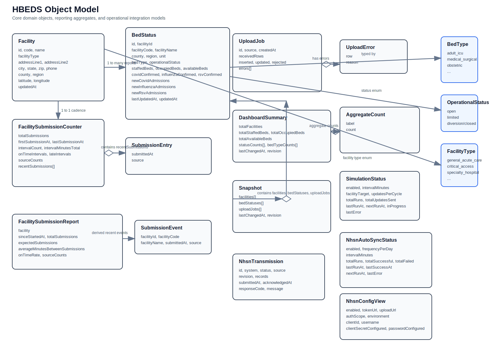
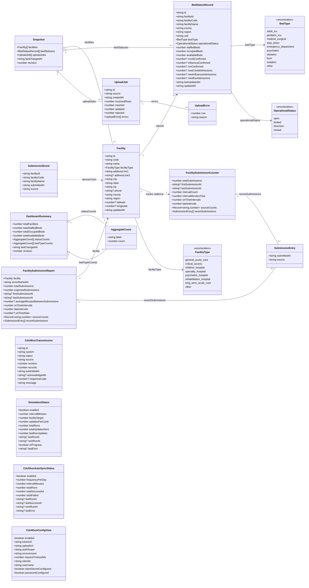

# HBEDS Object Model

This document captures the current object model implemented in the HBEDS app and server code.

## Diagram

## Mermaid Source

## Notes

- `Facility` is the master facility record and is seeded from California acute hospital data.
- `BedStatusRecord` is the core operational reporting entity and belongs to a facility.
- `FacilitySubmissionCounter` is an internal analytics object that tracks submission cadence per facility.
- `UploadJob` records the outcome of CSV/JSON bulk uploads, including rejected rows.
- `CdcNhsnTransmission`, `SimulationStatus`, `CdcNhsnAutoSyncStatus`, and `CdcNhsnConfigView` model operational/integration state rather than core clinical entities.
- FHIR `Location` and `Observation` resources are projections of `Facility` and `BedStatusRecord`, not separately persisted domain entities.
